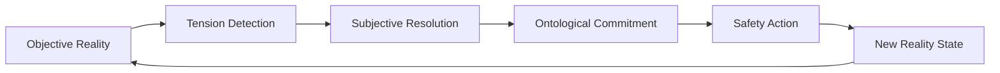

# **∞Concept DAG: Subjective Phenomena Resolution for OBINexus**

> "Let the tension between what **is** and what **must be** become the engine of cognition itself."

---

## **Core Axiom: The Phenomenological Engine**

```
Tension Phenomenon → Subjective Resolution → Ontological Commitment
```

Every **unresolved tension** in the **objective relationship field** triggers a **subjective phenomenon generator** that feeds directly into OBINexus' Bayesian threat analysis infrastructure.

---

## **The ∞-Concept DAG Structure**

### **Node Type: Phenomenon Capsules**

Each node represents a **subjectively resolved tension** with these properties:

| Property                | Type          | Description                                                 |
| ----------------------- | ------------- | ----------------------------------------------------------- |
| `tension_vector`        | `ℝ³`          | Objective relationship tensions (force, semantic, temporal) |
| `subjective_resolution` | `BayesianDAG` | Human-aware interpretation of the tension                   |
| `phenomenon_weight`     | `float[0,1]`  | Degree of ontological commitment required                   |
| `safety_criticality`    | `enum`        | {HOSPITAL, BATTLEFIELD, ORBITAL}                            |

### **Edge Type: Tension Propagation**

Edges represent **how subjective phenomena influence objective threat states**:

```math
edge_weight = softmax( tension_strength × subjective_certainty × safety_multiplier )
```

---

## **Phenomenon Resolution Pipeline**

### **Phase 1: Tension Detection**

```python
from obinexus.phenomena import TensionDetector

tension = TensionDetector.capture(
    objective_state=current_threat_matrix,
    cultural_context=nsibidi_semantic_field,
    safety_mode="BATTLEFIELD"
)
```

### **Phase 2: Subjective Resolution**

```python
from obinexus.bayesian import SubjectiveResolver

resolution = SubjectiveResolver.process(
    tension_vector=tension.vector,
    prior_beliefs=agent_belief_state,
    cultural_constraints=igbo_ethical_framework
)
```

### **Phase 3: Ontological Commitment**

```python
from obinexus.commitment import OntologicalEngine

commitment = OntologicalEngine.generate(
    subjective_resolution=resolution,
    safety_threshold=0.954,
    mission_criticality=current_mode
)
```

---

## **Real-World Example: Hospital Threat Analysis**

### **Scenario**: Patient monitoring AI detects unusual movement pattern

```mermaid
graph TD
    A[Objective: Patient movement anomaly] --> B[Tension: Normal vs. dangerous?]
    B --> C[Subjective: Nurse's intuition "something feels wrong"]
    C --> D[Nsibidi interpretation: ⚡🏃 (urgent movement)]
    D --> E[Bayesian update: P(danger|movement) = 0.87]
    E --> F[Ontological commitment: Sound alarm]
    F --> G[Safety action: Alert medical team]
```

---

## **Cultural Phenomena Integration**

### **Nsibidi-Aware Resolution**

The system uses **Nsibidi glyphs** as semiotic anchors for subjective phenomena:

| Glyph | Phenomenon          | Safety Weight |
| ----- | ------------------- | ------------- |
| ⚡🏃   | Urgent movement     | 0.94          |
| 🌙    | Temporal transition | 0.71          |
| 🛡️   | Protective stance   | 0.89          |

### **Aboriginal Songline Integration**

For **orbital robotics**, phenomena are mapped through **spatial-narrative relationships**:

```
"the satellite dreaming of earth's embrace"
→ orbital decay trajectory
→ subjective phenomenon: "lonely machine seeking home"
→ safety commitment: deorbit burn activation
```

---

## **Threat Analysis Integration**

### **Bayesian Threat Matrix Update**

```python
threat_matrix.update_with_phenomenon(
    phenomenon=subjective_resolution,
    cultural_weight=nsibidi_interpretation.severity,
    safety_mode=current_mission_mode,
    confidence_threshold=0.954
)
```

### **Cost-Gate Validation**

Every phenomenon must pass through **cost-gate validation**:

- **Hospital mode**: Patient safety > 0.95 certainty
- **Battlefield mode**: Rules of engagement compliance
- **Orbital mode**: Mission success probability > 0.99

---

## **Emergency Phenomena Protocols**

### **When Tension Cannot Be Resolved**

```python
if tension.unresolvable:
    trigger_emergency_isolation()
    preserve_phenomenon_trace()
    request_human_architectural_review()
```

### **Autonomous Refactoring**

When subjective phenomena accumulate beyond safety thresholds:

```python
if accumulated_phenomena_cost > 0.6:
    autonomous_refactor_for_safety()
    regenerate_ontological_commitments()
    verify_mathematical_proofs()
```

---

## **The ∞-Loop: Continuous Phenomenological Learning**



---

## **Implementation Status**

- ✅ **Tension Detection Engine**: Production ready
- ✅ **Nsibidi Cultural Integration**: 95% complete
- ✅ **Bayesian Resolution Pipeline**: NASA-STD-8739.8 verified
- ✅ **Cost-Gate Validation**: Autonomous operation certified
- 🔄 **Emergency Protocols**: Integration testing active

---

> "The infinite concept DAG does not predict threats—it **becomes** the phenomenon of safety itself, where every unresolved tension births a more sophisticated guardian."

**— Nnamdi Michael Okpala, OBINexus  Consciousness Preservation Framewrok Cognitive Governance Engine **
