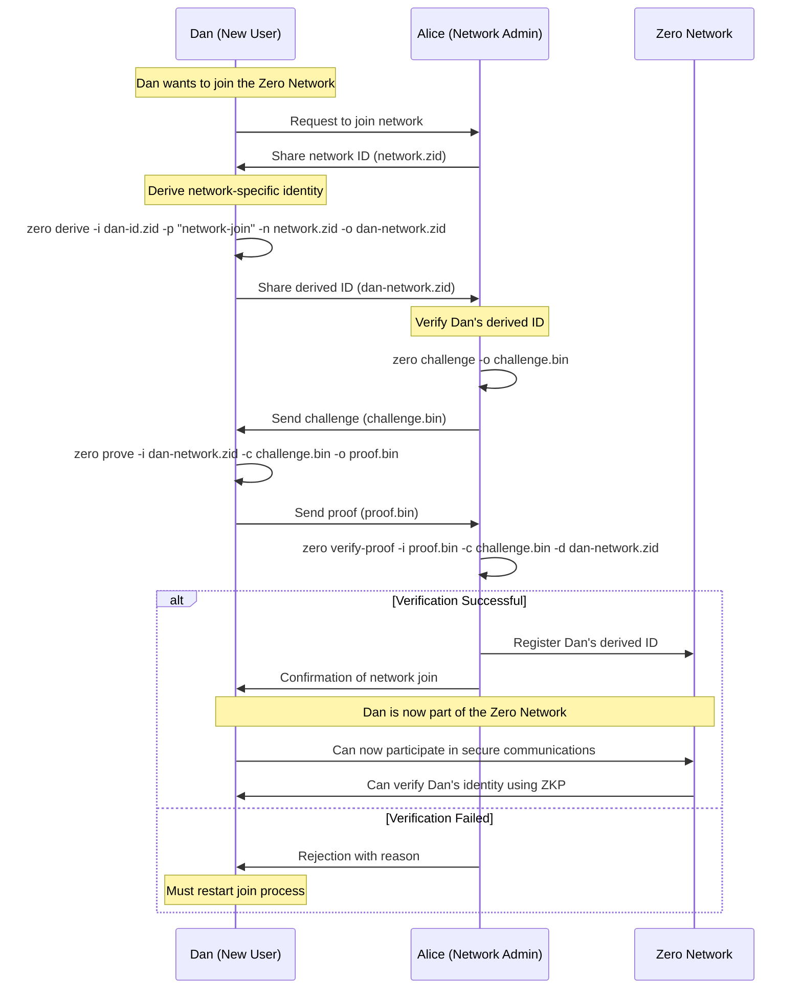

```mermaid
sequenceDiagram
    participant Dan as Dan (New User)
    participant Alice as Alice (Network Admin)
    participant Network as Zero Network
    
    Note over Dan: Dan wants to join the Zero Network
    
    Dan->>Alice: Request to join network
    Alice->>Dan: Share network ID (network.zid)

    Note over Dan: Derive network-specific identity
    Dan->>Dan: zero derive -i dan-id.zid -p "network-join" -n network.zid -o dan-network.zid
    
    Dan->>Alice: Share derived ID (dan-network.zid)
    
    Note over Alice: Verify Dan's derived ID
    Alice->>Alice: zero challenge -o challenge.bin
    Alice->>Dan: Send challenge (challenge.bin)
    
    Dan->>Dan: zero prove -i dan-network.zid -c challenge.bin -o proof.bin
    Dan->>Alice: Send proof (proof.bin)
    
    Alice->>Alice: zero verify-proof -i proof.bin -c challenge.bin -d dan-network.zid
    
    alt Verification Successful
        Alice->>Network: Register Dan's derived ID
        Alice->>Dan: Confirmation of network join
        
        Note over Dan, Network: Dan is now part of the Zero Network
        
        Dan->>Network: Can now participate in secure communications
        Network->>Dan: Can verify Dan's identity using ZKP
    else Verification Failed
        Alice->>Dan: Rejection with reason
        Note over Dan: Must restart join process
    end
```